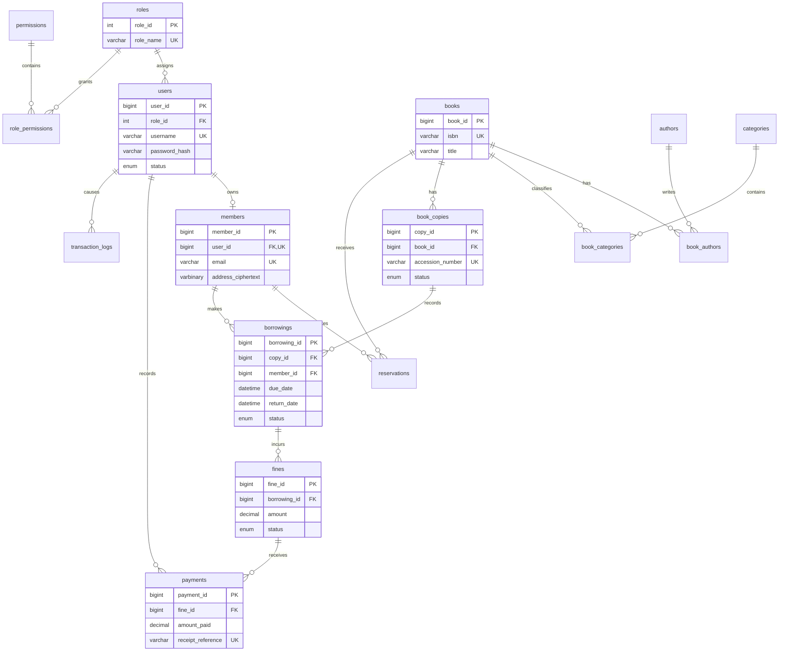

# LibraSys ERD source

```mermaid
erDiagram
    roles ||--o{ users : assigns
    users ||--o| members : owns
    roles ||--o{ role_permissions : grants
    permissions ||--o{ role_permissions : contains
    books ||--o{ book_authors : has
    authors ||--o{ book_authors : writes
    books ||--o{ book_categories : classifies
    categories ||--o{ book_categories : contains
    books ||--o{ book_copies : has
    members ||--o{ reservations : makes
    books ||--o{ reservations : receives
    members ||--o{ borrowings : makes
    book_copies ||--o{ borrowings : records
    borrowings ||--o{ fines : incurs
    fines ||--o{ payments : receives
    users ||--o{ payments : records
    users ||--o{ transaction_logs : causes

    roles {
        int role_id PK
        varchar role_name UK
    }
    users {
        bigint user_id PK
        int role_id FK
        varchar username UK
        varchar password_hash
        enum status
    }
    members {
        bigint member_id PK
        bigint user_id FK,UK
        varchar email UK
        varbinary address_ciphertext
    }
    books {
        bigint book_id PK
        varchar isbn UK
        varchar title
    }
    book_copies {
        bigint copy_id PK
        bigint book_id FK
        varchar accession_number UK
        enum status
    }
    borrowings {
        bigint borrowing_id PK
        bigint copy_id FK
        bigint member_id FK
        datetime due_date
        datetime return_date
        enum status
    }
    fines {
        bigint fine_id PK
        bigint borrowing_id FK
        decimal amount
        enum status
    }
    payments {
        bigint payment_id PK
        bigint fine_id FK
        decimal amount_paid
        varchar receipt_reference UK
    }
```
